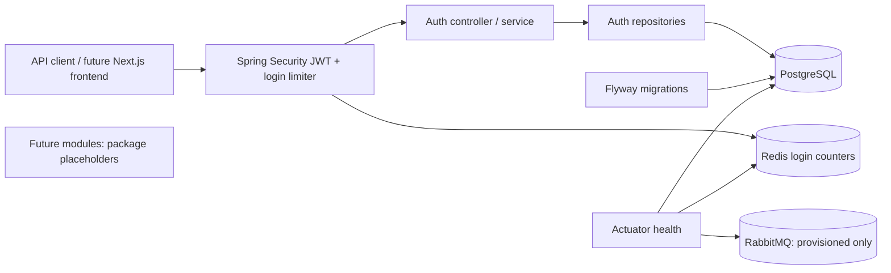

# Architecture — Week 1

TicketRush is a Java 21 / Spring Boot modular monolith. PostgreSQL is the source
of truth. Only authentication is implemented in this milestone.



## Module boundaries

Base package: `com.vibe.ticketrush`. Modules: `auth`, `event`, `inventory`,
`reservation`, `order`, `payment`, `queue`, `notification`, `outbox`, `admin`,
`common`. Each has `controller`, `service`, `repository`, `domain`, and `dto`
packages. Future modules contain package documentation only. Cross-module
communication must use service interfaces or domain events, never another
module's repository. `common` holds the error contract and OpenAPI configuration.

## HTTP security

| Endpoint | Authorization |
| --- | --- |
| POST `/api/v1/auth/register` | Public; assigns USER only |
| POST `/api/v1/auth/login` | Public; atomic per-peer-IP rate limit |
| POST `/api/v1/auth/refresh` | Possession of an active refresh token |
| POST `/api/v1/auth/logout` | Possession of the token to revoke; idempotent |
| GET `/api/v1/auth/me` | USER or ADMIN access JWT |
| GET `/actuator/health`, `/liveness`, `/readiness` under health | Public; no details |
| Other Actuator endpoints | ADMIN; only health/info exposed |
| `/api/v1/admin/**` | ADMIN; no business endpoints yet |
| Swagger / OpenAPI | Public in dev/test; disabled in prod |
| Any other request | Denied |

Access JWTs use HS256, issuer, audience, expiry, UUID subject, and role claims.
Refresh tokens are 256-bit random opaque values; only SHA-256 hashes are stored.
Passwords use BCrypt cost 12, minimum 12 characters and maximum 72 UTF-8 bytes.
Emails are trimmed/lowercased and uniquely constrained in PostgreSQL.

API tokens are returned in response bodies with `Cache-Control: no-store`.
There is no cookie authentication, so CSRF is disabled. CORS is not enabled;
frontend integration and browser token storage decisions belong to a later task.
Use TLS for any non-local deployment. JWT role changes take effect on the next
issued access token; existing tokens remain valid until expiry (15 minutes).

All application and security errors use:

```json
{
  "timestamp": "2026-10-07T00:00:00Z",
  "status": 400,
  "code": "VALIDATION_ERROR",
  "message": "Invalid request",
  "path": "/api/v1/auth/register",
  "fieldErrors": {"email": "must be a well-formed email address"}
}
```

Parser/validation errors are 400, authentication failures 401, authorization
failures 403, uniqueness conflicts 409, login quota 429 (with Retry-After), and
Redis unavailability during login 503. Unexpected errors return a generic 500.

## Profiles and deployment

`dev` is the default and Compose profile. `test` uses real ephemeral containers
and runtime-generated secrets. `prod` disables OpenAPI and uses graceful shutdown.
All profiles validate the Hibernate schema; only Flyway changes it.
Compose waits for healthy dependencies, runs the backend as a non-root user,
and binds published ports to loopback. PostgreSQL and RabbitMQ have named volumes;
Redis login counters are intentionally ephemeral.

This milestone does not implement reservations, overselling prevention logic,
payments, idempotency keys, queues, outbox publishing, frontend, or monitoring
dashboards. Quantity constraints prepare the schema but do not prove booking
correctness. See the ADRs for rotation and rate-limit tradeoffs.
