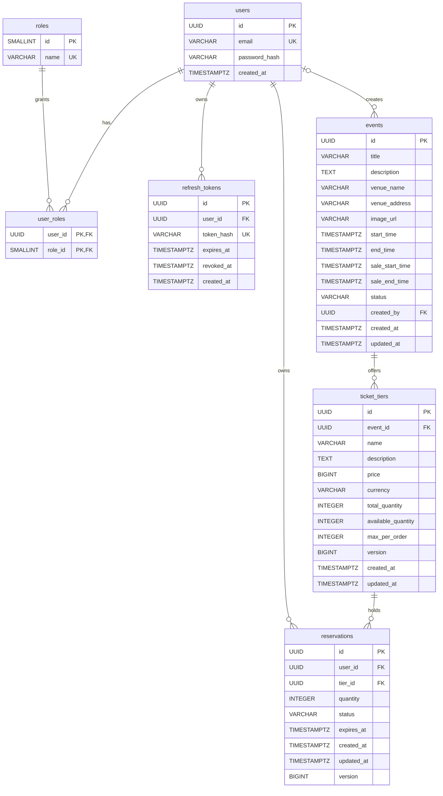
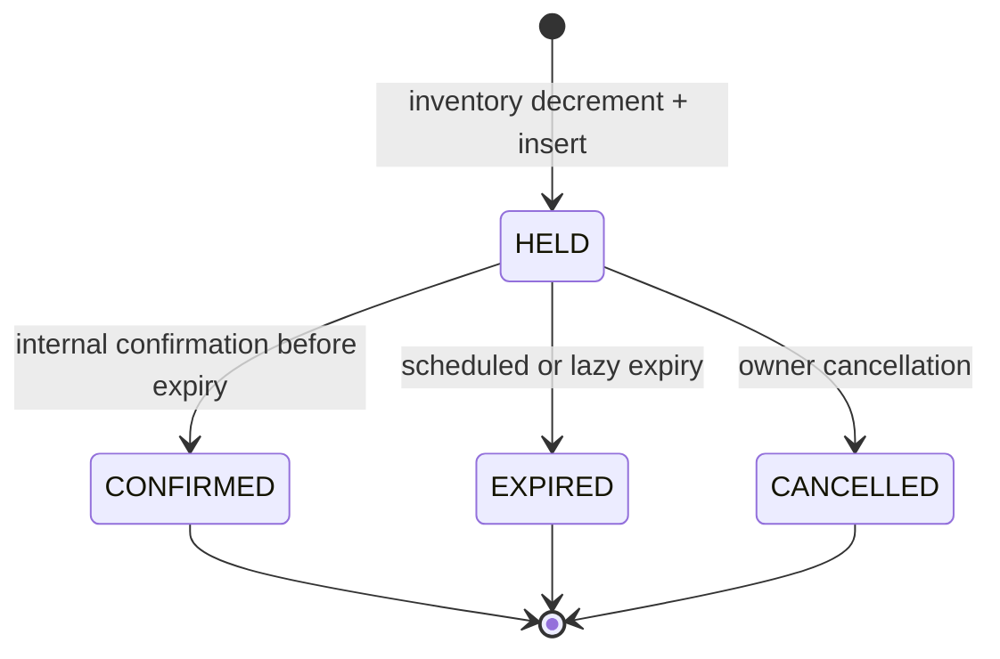

# Database — migration V1

PostgreSQL 17; UUID application identifiers; UTC timestamps stored as TIMESTAMPTZ.
Flyway owns schema changes; Hibernate uses `ddl-auto=validate`.

## Constraints and indexes

- `users.email` is unique and must equal `lower(trim(email))`; the application
  validates syntax and length. `password_hash` stores BCrypt, never plaintext.
- Roles are seeded as USER (1) and ADMIN (2). Registration cannot select a role.
- `user_roles` uses `(user_id, role_id)` as its primary key and indexes `role_id`.
- `refresh_tokens.token_hash` has a unique index for token lookup and row locking.
  Indexes on `user_id` and `expires_at` support session lookup and future cleanup.
  Expiry must follow creation. Revoked rows are retained; scheduled cleanup is
  deferred, so operators must plan retention before production use.
- V2 renames `events.name` to `title` and `starts_at` to `start_time`. V1 is unchanged.
- `events(status, start_time)` supports public chronological lists;
  `events(sale_start_time)` supports sale-window lookup. The V1 single start index
  remains valid after the rename. `ticket_tiers(event_id)` is explicitly indexed.
- Event date CHECK requires end > start and sale_start < sale_end <= start.
  Titles and tier names must not be blank. Status is restricted to DRAFT,
  PUBLISHED, CANCELLED, ENDED; transition rules are enforced by the service.
- `created_by` references users; null is reserved for legacy rows/system fixtures.
  API-created events always record the ADMIN's UUID.
- V2 converts decimal prices to BIGINT minor units (legacy USD assumption), adds
  uppercase currency, max_per_order >=1, description and timestamps.
- `ticket_tiers` enforces nonnegative price, total quantity, available quantity,
  and version, plus `available_quantity <= total_quantity`.
  Unique `(event_id, name)` also indexes the event foreign key (leftmost prefix).
- Deleting a user cascades to role assignments and refresh tokens. Event deletion
  is restricted while ticket tiers exist.

## Transaction behavior

Registration inserts the user and USER assignment in one transaction. The unique
email index handles concurrent registration; one transaction wins, others get 409.

Refresh performs `SELECT ... FOR UPDATE` on the hash, validates expiry/revocation,
revokes the old row, and inserts the next token in one transaction. A concurrent
loser sees the committed revocation and receives 401. Logout locks the same row.
No booking concurrency behavior is implemented by V1 alone.

## Week 2 capacity updates

`available_quantity` is the authoritative remaining counter. Initial available is
exactly total. Atomic conditional UPDATE adjusts available by new_total-old_total
and rejects new_total < old_total-available. See ADR 0004 for SQL and locking.
No sold/held columns are introduced: their combined quantity is derived from the
counters until later milestones add the corresponding business records.

Native updates increment version and updated_at in PostgreSQL and clear the JPA
persistence context. All event/tier administrative mutations lock the owning event
row to serialize lifecycle/price-window checks. Foreign keys restrict deletion of
creators/events referenced by event/tier rows.

V2 backfills existing events as DRAFT with a one-hour duration and one-day sale
window. Review legacy data before publication. Dev fixtures use deterministic IDs,
batched INSERT ON CONFLICT and a single transaction; restarts preserve inventory.

## V3: reservation lifecycle and inventory

`quantity >= 1`; status has a CHECK constraint. Partial unique index
`uq_reservations_active(user_id,tier_id) WHERE status='HELD'` enforces one active
hold, including racing requests. Indexes cover `(status,expires_at)`,
`(user_id,created_at,id)` and tier joins. Foreign keys preserve ownership and tier references.
All status transitions use `UPDATE ... WHERE id=? AND status='HELD'`; affected row
count grants the exclusive right to restore inventory. Each SQL counter/status
update increments version. Reservation insertion and decrement share one transaction;
terminal release and increment also share one transaction.

Per tier: `available_quantity + SUM(HELD.quantity) + SUM(CONFIRMED.quantity) = total_quantity`.
Expired unswept rows still count as HELD until their transaction releases stock.
Confirmation transfers HELD to CONFIRMED without changing available stock.
The reconcile query aggregates both states in one snapshot and returns violations.

Expiry selects a bounded batch ordered by `(expires_at,id)` with
`FOR UPDATE SKIP LOCKED`. Each scheduled tick processes one batch to bound transaction
size; later ticks continue the backlog. Multiple instances can claim different rows.
Lazy reads, listing, confirmation and cancellation also expire stale holds.
Create releases that user's expired holds before checking the partial unique key.
The expiry boundary is strict `expires_at < clock.instant()` as in the task's query.
Operations set transaction-local PostgreSQL `lock_timeout=3s`.

Configuration: `RESERVATION_STRATEGY=conditional-update|optimistic|pessimistic`,
`RESERVATION_HOLD_DURATION=10m`, `RESERVATION_JOB_INTERVAL=30s`,
`RESERVATION_BATCH_SIZE=100`, `RESERVATION_OPTIMISTIC_ATTEMPTS=20`,
`RESERVATION_EXPIRY_ENABLED=true`. Clock defaults to UTC and tests replace it.
