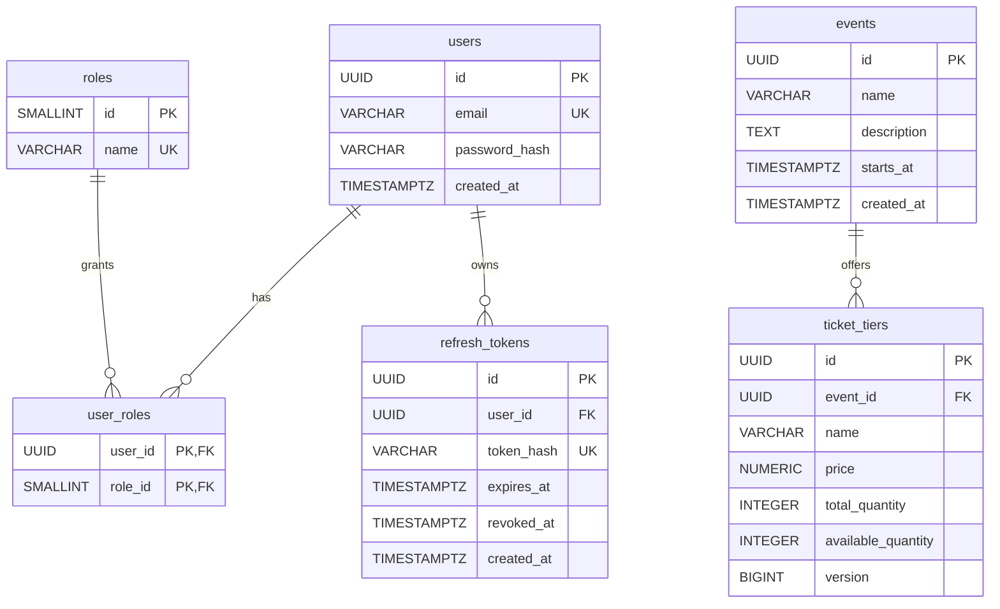

# Database — migration V1

PostgreSQL 17; UUID application identifiers; UTC timestamps stored as TIMESTAMPTZ.
Flyway owns schema changes; Hibernate uses `ddl-auto=validate`.

## Constraints and indexes

- `users.email` is unique and must equal `lower(trim(email))`; the application
  validates syntax and length. `password_hash` stores BCrypt, never plaintext.
- Roles are seeded as USER (1) and ADMIN (2). Registration cannot select a role.
- `user_roles` uses `(user_id, role_id)` as its primary key and indexes `role_id`.
- `refresh_tokens.token_hash` has a unique index for token lookup and row locking.
  Indexes on `user_id` and `expires_at` support session lookup and future cleanup.
  Expiry must follow creation. Revoked rows are retained; scheduled cleanup is
  deferred, so operators must plan retention before production use.
- `events.starts_at` supports chronological lookup.
- `ticket_tiers` enforces nonnegative price, total quantity, available quantity,
  and version, plus `available_quantity <= total_quantity`.
  Unique `(event_id, name)` also indexes the event foreign key (leftmost prefix).
- Deleting a user cascades to role assignments and refresh tokens. Event deletion
  is restricted while ticket tiers exist.

## Transaction behavior

Registration inserts the user and USER assignment in one transaction. The unique
email index handles concurrent registration; one transaction wins, others get 409.

Refresh performs `SELECT ... FOR UPDATE` on the hash, validates expiry/revocation,
revokes the old row, and inserts the next token in one transaction. A concurrent
loser sees the committed revocation and receives 401. Logout locks the same row.
No booking concurrency behavior is implemented by V1 alone.
