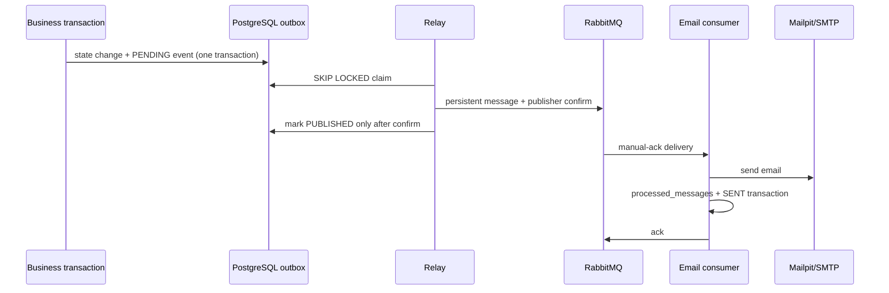
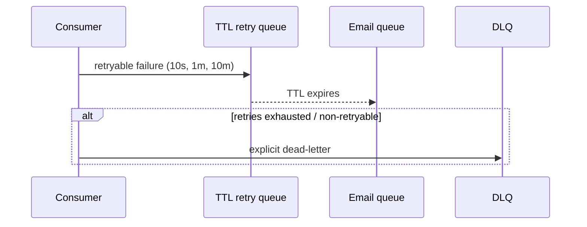

# Event contract

All events use JSON envelope version 1:

```json
{"eventId":"UUID","eventType":"order.paid","schemaVersion":1,"aggregateType":"order","aggregateId":"UUID","occurredAt":"2026-10-10T00:00:00Z","correlationId":"UUID","payload":{"orderId":"UUID","userId":"UUID"}}
```

`eventId` is the outbox primary key. It is generated once in the business
transaction and is retained across relay retries. Consumers must treat it as the
deduplication key. Timestamps are UTC ISO-8601.

| Event type | Aggregate | Payload |
|---|---|---|
| `reservation.created`, `reservation.expired`, `reservation.cancelled` | reservation | `reservationId`, `userId` |
| `order.created`, `order.paid`, `order.payment_failed`, `order.cancelled`, `order.expired`, `order.refund_requested`, `order.refunded` | order | `orderId`, `userId` |
| `ticket.issued` | order | `orderId`, `userId` |

Payloads intentionally have no card data, email address, or other full user PII.
The email consumer resolves the address through the auth module interface.

New fields are additive. Consumers ignore event types they do not own and safely
ack a schema version newer than they support after logging it. A breaking change
requires a new event type or schema version with a parallel consumer rollout.

## Delivery flow




