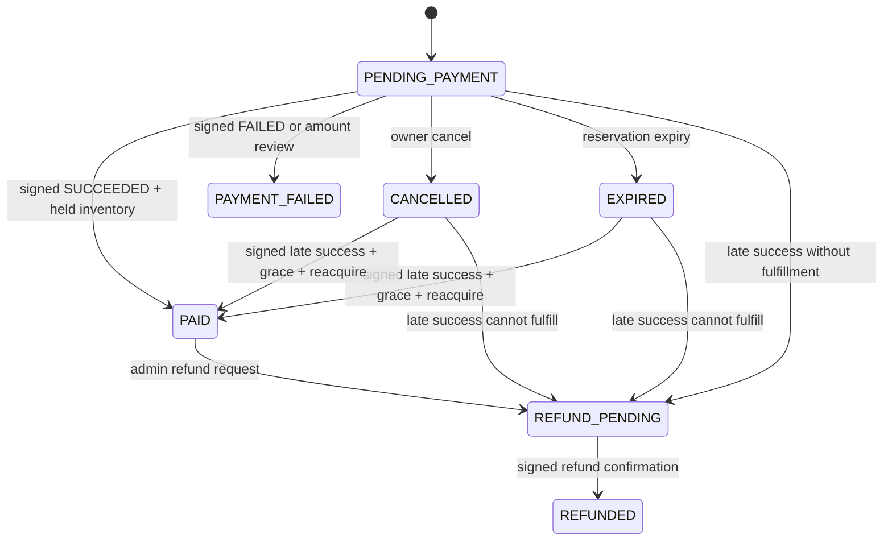
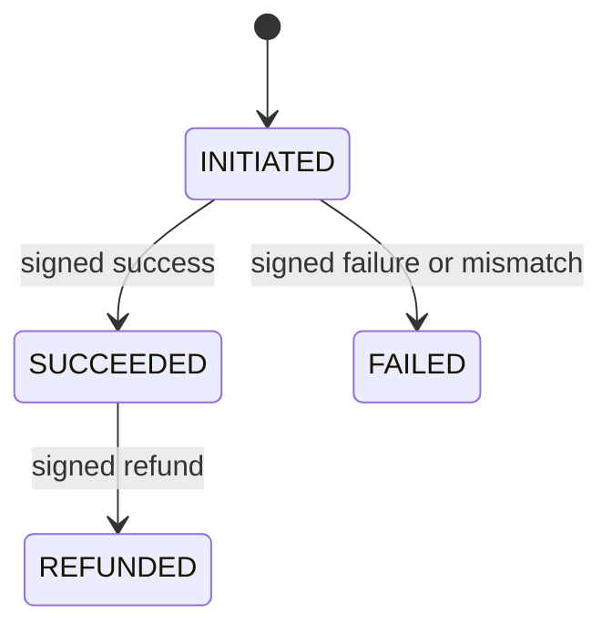
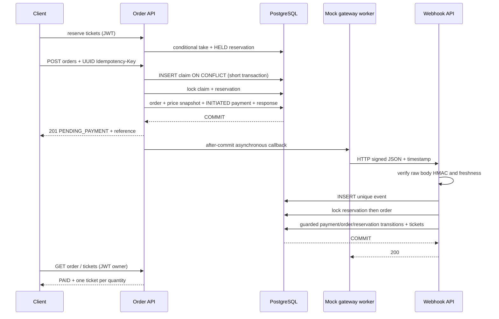

# Week 4 purchase lifecycle

```mermaid
stateDiagram-v2
    [*] --> PENDING_PAYMENT
    PENDING_PAYMENT --> PAID: signed SUCCEEDED + held inventory
    PENDING_PAYMENT --> PAYMENT_FAILED: signed FAILED or amount review
    PENDING_PAYMENT --> CANCELLED: owner cancel
    PENDING_PAYMENT --> EXPIRED: reservation expiry
    PENDING_PAYMENT --> REFUND_PENDING: late success without fulfillment
    EXPIRED --> PAID: signed late success + grace + reacquire
    CANCELLED --> PAID: signed late success + grace + reacquire
    EXPIRED --> REFUND_PENDING: late success cannot fulfill
    CANCELLED --> REFUND_PENDING: late success cannot fulfill
    PAID --> REFUND_PENDING: admin refund request
    REFUND_PENDING --> REFUNDED: signed refund confirmation
```

```mermaid
stateDiagram-v2
    [*] --> INITIATED
    INITIATED --> SUCCEEDED: signed success
    INITIATED --> FAILED: signed failure or mismatch
    SUCCEEDED --> REFUNDED: signed refund
```

```mermaid
sequenceDiagram
    participant C as Client
    participant API as Order API
    participant DB as PostgreSQL
    participant M as Mock gateway worker
    participant W as Webhook API
    C->>API: reserve tickets (JWT)
    API->>DB: conditional take + HELD reservation
    C->>API: POST orders + UUID Idempotency-Key
    API->>DB: INSERT claim ON CONFLICT (short transaction)
    API->>DB: lock claim + reservation
    API->>DB: order + price snapshot + INITIATED payment + response
    DB-->>API: COMMIT
    API-->>C: 201 PENDING_PAYMENT + reference
    API->>M: after-commit asynchronous callback
    M->>W: HTTP signed JSON + timestamp
    W->>W: verify raw body HMAC and freshness
    W->>DB: INSERT unique event
    W->>DB: lock reservation then order
    W->>DB: guarded payment/order/reservation transitions + tickets
    DB-->>W: COMMIT
    W-->>M: 200
    C->>API: GET order / tickets (JWT owner)
    API-->>C: PAID + one ticket per quantity
```
